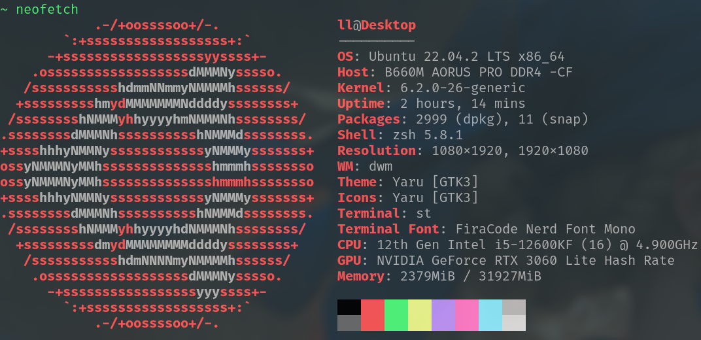
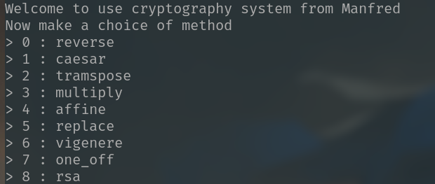
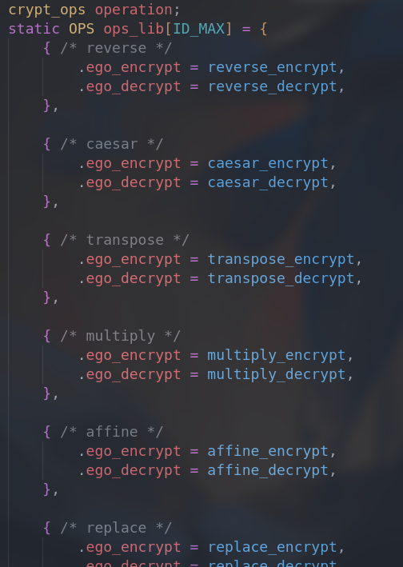

# Training of cryptography

| Date       | Author  | Description           |
| ---------- | ------- | --------------------- |
| 2023/08/11 | Manfred | First release         |
| 2023/08/25 | Manfred | Filled the frame done |

**Experimental Environment**

---

This project is about classical ciphers which includes the follow items:

- [x] reverse
- [x] caesar
- [x] transpose
- [x] multiply
- [x] affine
- [x] replace
- [x] vigenere
- [x] rsa

After running this program (`./launch`) , you'd have to select the encrypt method. Depending on the method, `key` maybe be needed.

<u>The different encrypt method correspond to different operation.</u>

